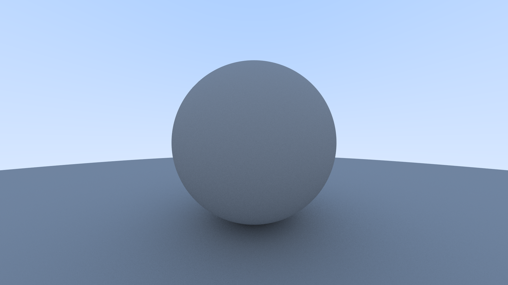

# raytracer

wip raytracer written from scratch in C++. the program processes a defined scene then rasterizes it and outputs a `.tga` file. future versions will allow the loading of 3d `.ply` models.

# eye-candy

# how it works

## overview

a `Scene` object contains a collection of world objects.

a `Camera` can draw a given scene. when drawing, the camera casts rays to the screen in order to rasterize the shapes in the scene. after each ray the result is save into a pixel of a `Vector3` buffer of size `width` x `height`. This buffer is then dumped into a .tga file so it can be visualized.

## anti aliasing

to avoid image "rough edges" on the rendering we cast multiple rays per pixel with a slight randomized offset on each ray. then we average the results and use that as the pixel value. 

## lighting

## effects

# other

## c++ version

i am using C++ 17 to take advantage of `std::execution`

## code style

it tries to follow [Google's C++ style guide](https://google.github.io/styleguide/cppguide.html)
