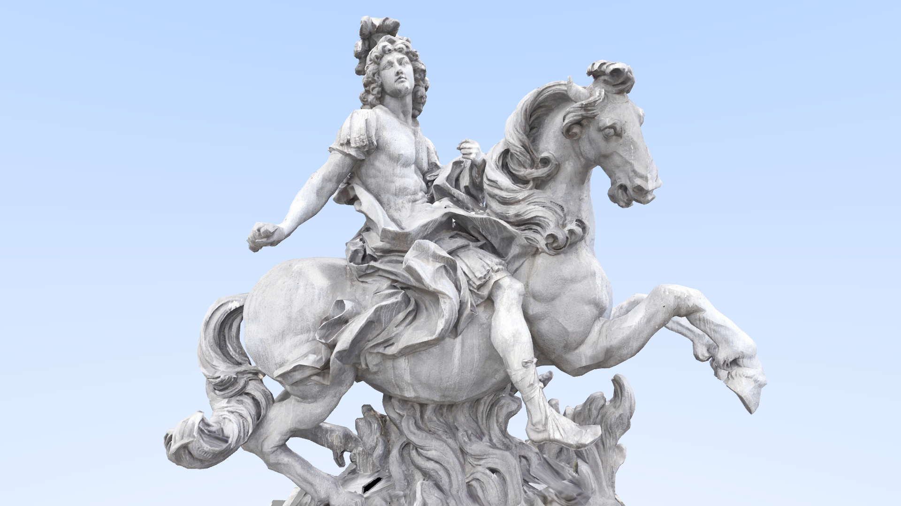

# raytracer

wip raytracer written from scratch in C++. the program processes a defined scene then rasterizes it and outputs a `.tga` file. the program support both doing the calculations on the CPU using C++ 11 threads or offloading the calculations to the GPU using CUDA.

# eye-candy

# features

* perpective camera ✔️
* ambient occlusion ✔️
* uv mapping ✔️
* diffuse shading ✔️
* metal shading ❓
* lights ❓

# benchmarks

coming soon

# how it works

## overview

a `Scene` object contains a collection of volumes.

a `Camera` can draw a given scene. when drawing, the camera casts rays to the screen in order to rasterize the volumes in the scene. after each ray the result is save into a pixel of a `Vector3` buffer of size `width` x `height`. This buffer is then dumped into a `.tga` file so it can be visualized.

current supported volumes are `Triangle`s (i know its not technicaly a volume) ~and `Sphere`s`~. `Triangle` support allows us to load custom models.

## backends

the project currently has 2 available backends to use for computation, these are `--backend=gpu` and `--backend=cpu`. when the backend is `gpu`, computations are offloaded to the GPU using CUDA, otherwise they are done by the CPU in different threads.

## models

current version supports the loading of 3d `.ply` models. model loading is done via a simple parser written in C++ (see `src/io/ply.h`), from it a group of triangles are extracted and these are used to raycast against. support for obj is also available thanks to an external lib (see credits)

to calculate the intersection between a triangle and a ray the engine uses the [Möller–Trumbore intersection algorithm](https://en.wikipedia.org/wiki/M%C3%B6ller%E2%80%93Trumbore_intersection_algorithm) 

## bvh

in order to speed up collision detection a [Bounding Volume Hierarchy is used (BVH)](https://en.wikipedia.org/wiki/Bounding_volume_hierarchy), triangles are divided into smaller and smaller aabb so we can discard a lot of the search space on each collision test, much like a BST but in 3d. Because of CUDA limitations with recursion and virtual methods, the BVH is built on the CPU and then an iterative array based version is generated and copied to the GPU memory. see `src/volumes/bvh.cu` and `src/volumes/gpu_bvh.cu` for the respective implementations.

## materials
cpu materials (`Material`) and gpu materials (`GPUMaterial`) are the same object (`src/materials/material.h`). materials are created on the CPU (in other to load the textures) and then can be copied to the GPU, in that case the internal texture memory of the material is copied to the GPU and marked as a GPUMaterial.

different material types / shading modes will be held by the same class. although is not optimal, this is by design, it helps reduce the amount of inheritance and duplication of code so it's easier to port it to the CUDA backend.

## anti aliasing

to avoid image "rough edges" on the rendering we cast multiple rays per pixel with a slight randomized offset on each ray. then we average the results and use that as the pixel value. 

## lighting

### diffuse

in order to model diffuse lighting we simulate the way light rays works. whenever a ray hits something depeding on it's reflectivity, it can either be absorbed or bounce of it. repeat this enough times and the light models itself

### metal

_shiny_

## effects

# other

## c++ version

~i am using C++ 17 to take advantage of `std::execution`~ the project now uses CUDA, so i changed to C++11 since thats what `nvcc` supports.

## code style

it tries to follow [Google's C++ style guide](https://google.github.io/styleguide/cppguide.html) though some stuff may be off.

# credits
* JPEG loading code used from [nothings/stb](https://github.com/nothings/stb)
* OBJ loading code used from [thisistherk/fast_obj](https://github.com/thisistherk/fast_obj) 
* The triangle intersection algorithm used is from [Fast Minimum Storage Ray/Triangle Intersection](https://cadxfem.org/inf/Fast%20MinimumStorage%20RayTriangle%20Intersection.pdf)
* ["Louis XIV de France, Louvre, Paris"](https://skfb.ly/QI67) by HoangHiepVu is licensed under Creative Commons Attribution (http://creativecommons.org/licenses/by/4.0/).
